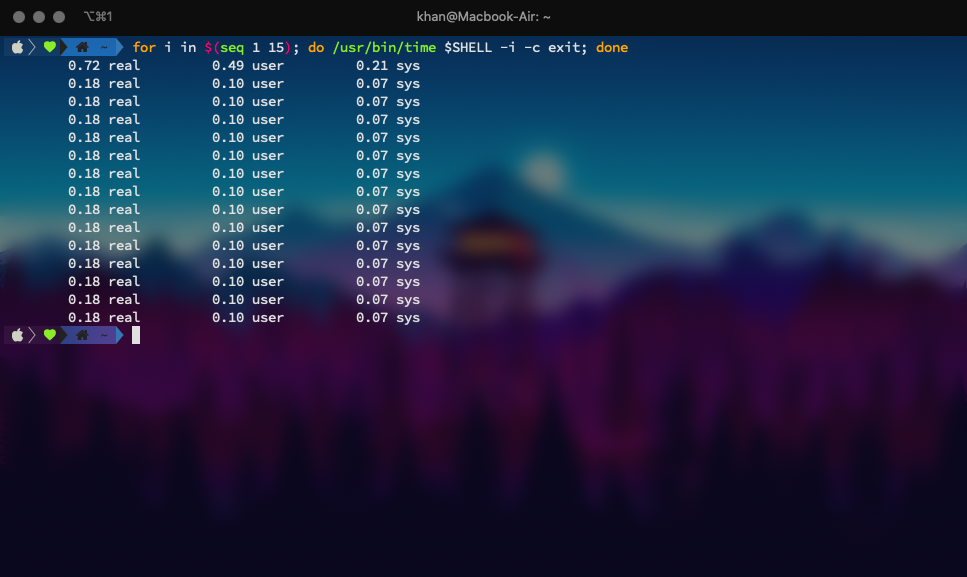

# Overview

Created: Aug 21, 2020 12:33 PM
Include Wallpapers and pre-configured files

# Windows 10

## Install Microsoft WSL 2 + Linux Distribution
    https://docs.microsoft.com/en-us/windows/wsl/install-win10

## Install Windows Terminal

install Windows Terminal on Microsoft Store

More details:
    https://github.com/microsoft/terminal

### Themes & settings

https://allthings.how/windows-terminal-themes-light-dark-colorful/

recommended: 'matrix-01'

        {    
            "name": "Monokai Seti Dark",
            "foreground": "#F8F8F2",
            "background": "#151718",
            "black": "#151718",
            "brightBlack": "#625e4c",
            "blue": "#9D65FF",
            "brightBlue": "#9D65FF",
            "cyan": "#58D1EB",
            "brightCyan": "#58D1EB",
            "green": "#98F424",
            "brightGreen": "#98F424",
            "purple": "#F4005F",
            "brightPurple": "#F4005F",
            "red": "#F4005F",
            "brightRed": "#F4005F",
            "white": "#F8F8F2",
            "brightWhite": "#f6f6ef",
            "yellow": "#FA8419",
            "brightYellow": "#FA8419"
        },
        {
            "name": "bento",
            "foreground": "#fffaf8",
            "background": "#2d394d",
            "black": "#2d394d",
            "brightBlack": "#5b7c8d",
            "blue": "#4a768d",
            "brightBlue": "#5b7c8d",
            "cyan": "#58D1EB",
            "brightCyan": "#58D1EB",
            "green": "#98F424",
            "brightGreen": "#98F424",
            "purple": "#ee2a3a",
            "brightPurple": "#ff7a90",
            "red": "#ee2a3a",
            "brightRed": "#ff7a90",
            "white": "#fffaf8",
            "brightWhite": "#fffaf8",
            "yellow": "#FA8419",
            "brightYellow": "#FA8419"
        },
        {
            "name": "matrix-01",
            "foreground": "#ddc49a", // RAL 1014
            "background": "#191e28", // RAL 5004
            "black": "#ddc49a", // RAL 1014
            "brightBlack": "#808076", // RAL 7023
            "blue": "#314f6f", // RAL 5000
            "brightBlue": "#1f3855", // RAL 5003
            "cyan": "#058b8c", // RAL 5018
            "brightCyan": "#0f4c64", // RAL 5001
            "green": "#61993b", // RAL 6018
            "brightGreen": "#3c7460",  // RAL 6000
            "purple": "#651e38", // RAL 4004
            "brightPurple": "#8d3c4b", // RAL 4002
            "red": "#ab273c", // RAL 3027
            "brightRed": "#c73f4a", // RAL 3018
            "white": "#f1ece1", // RAL 9010
            "brightWhite": "#ecece7", // RAL 9003
            "yellow": "#da6e00", // RAL 2000
            "brightYellow": "#ffb200" //RAL 2007
        } 

> `settings.json`

## VScode settings

This set Matrix-01 theme to Vscode terminal

    "workbench.colorCustomizations": {
        "terminal.foreground": "#ddc49a",
        "terminal.background": "#191e28",
        "terminal.ansiBlack": "#ddc49a",
        "terminal.ansiBrightBlack": "#808076",
        "terminal.ansiBlue": "#314f6f",
        "terminal.ansiBrightBlue": "#1f3855",
        "terminal.ansiCyan": "#058b8c",
        "terminal.ansiBrightCyan": "#0f4c64",
        "terminal.ansiGreen": "#61993b",
        "terminal.ansiBrightGreen": "#3c7460",
        "terminal.ansiMagenta": "#651e38",
        "terminal.ansiBrightMagenta": "#8d3c4b",
        "terminal.ansiRed": "#ab273c",
        "terminal.ansiBrightRed": "#c73f4a",
        "terminal.ansiWhite": "#f1ece1",
        "terminal.ansiBrightWhite": "#ecece7",
        "terminal.ansiYellow": "#da6e00",
        "terminal.ansiBrightYellow": "#ffb200"
    }

### Install essential programs:

1. VS Code
2. IDM
3. WinRAR (key included)
4. PicoTorrent
5. KMPlayer

# MacOS
## Installing Iterm2
MacOS's intergrated terminal works just fine, but iTerms2 has more customization options

    https://www.iterm2.com/downloads.html

# Configuring Terminal

## 1. Install ZSH

### Ubuntu:

    sudo apt install zsh   

- set your ZSH as default shell (Depriciated since it is recommended to set ZSH as default shell automatically by Oh-My-ZSH)

        chsh -s $(which zsh)

### MacOS

Skip this step if you are on MacOS Catalina and above.

    brew install zsh

## 2. Install Oh-My-ZSH 

https://ohmyz.sh/#install

        sh -c "$(curl -fsSL https://raw.github.com/ohmyzsh/ohmyzsh/master/tools/install.sh)"

### Plug-ins

- zsh-autosuggestions

        git clone https://github.com/zsh-users/zsh-autosuggestions ${ZSH_CUSTOM:-~/.oh-my-zsh/custom}/plugins/zsh-autosuggestions

- zsh-syntax-highlighting

        git clone https://github.com/zsh-users/zsh-syntax-highlighting.git $ZSH_CUSTOM/plugins/zsh-syntax-highlighting

- zsh-z

        git clone https://github.com/agkozak/zsh-z $ZSH_CUSTOM/plugins/zsh-z

- zsh-nvm (optional)

    Install nvm as a zsh plugin. Install zsh-nvm and run `nvm upgrade` to upgrade.
        
        git clone https://github.com/lukechilds/zsh-nvm ~/.oh-my-zsh/custom/plugins/zsh-nvm

- git-open (optional)

    https://github.com/paulirish/git-open
        
## 3. Install Powerlevel10k

https://github.com/romkatv/powerlevel10k

    git clone --depth=1 https://github.com/romkatv/powerlevel10k.git ${ZSH_CUSTOM:-$HOME/.oh-my-zsh/custom}/themes/powerlevel10k

## 4. Install Nerd Fonts

https://www.nerdfonts.com/
For best support and less bugs please consider using:

    VictorMono Nerd Font

## 5. Customize / clone `.zshrc` from this GitHub repo
https://github.com/kl14n/Personal-Configuration-Backup

# Neovim

- (optional) Remove the current version of NeoVim 

        sudo apt-remove neovim

- Download the latest `nvim.appimage` from GitHub:

        https://github.com/neovim/neovim   

- Make it executable for your user
        
        chmod u+x ./nvim.appimage

- Move it to a folder that's indexed in your PATH env var so your computer knows what you mean when you type `nvim`.

    - You can check the folders in your current path by typing `echo $PATH` which will show you something like this: /usr/local/bin:/usr/bin... 

- To move it there you'll need to use sudo: 

        sudo mv nvim.appimage /usr/local/bin/nvim

- When you type `nvim` it should work

    - Bonus: add this to ~/.zshrc etc to create an alias in case you accidentally type vi (I always type it by mistake): alias vi=nvim

    - Bonus: Also in your bashrc/zshrc etc set your EDITOR env var so various programs know what editor you prefer to use: EDITOR=/usr/local/bin/nvim

- To update, download the latest `nvim.appimage` and `mv` it to `/nvim`

# Extras 
### Packages, plug-ins, formulae,...

- lsd: https://github.com/Peltoche/lsd
- python
- neovim
<!-- - homebrew / linuxbrew -->

# Trivial
1. To see how different colors look in your terminal, run the following command:

        for i in {0..255}; do print -Pn "%K{$i}  %k%F{$i}${(l:3::0:)i}%f " ${${(M)$((i%6)):#3}:+$'\n'}; done

2. You can time your shell's start up time with
        
        for i in $(seq 1 15); do /usr/bin/time $SHELL -i -c exit; done

    

## Extravagent mode

just for fun:
1. add background image
2. retro effects on Windows Terminal

### Set up
put this in the `defaults` profiles in Windows Terminal `Settings.json`

        "useAcrylic": true,
        "acrylicOpacity": 0.5,
        "backgroundImage": "<path to imange>",
        "backgroundImageOpacity": 0.2,
        "experimental.retroTerminalEffect": true
